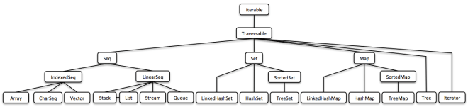

== Introducción

Vavr (anteriormente conocido como Javaslang) es una biblioteca funcional para Java 8+ que ofrece tipos de datos persistentes y estructuras de control funcionales.

=== Estructuras de Datos Funcionales en Java 8 con Vavr

Las https://docs.oracle.com/javase/tutorial/java/javaOO/lambdaexpressions.html[lambdas (λ)] de Java 8 nos permiten crear API maravillosas. Incrementan increíblemente la expresividad del lenguaje.

http://vavr.io/[Vavr] aprovechó las lambdas para introducir diversas características nuevas basadas en patrones funcionales. Una de ellas es una biblioteca de colecciones funcionales diseñada como un reemplazo para las colecciones estándar de Java.

__(Esta es solo una vista general; encontrarás una versión más detallada y legible a continuación.)__

=== Programación Funcional

Antes de profundizar en los detalles sobre las estructuras de datos, quiero hablar sobre algunos conceptos básicos. Esto ayudará a entender por qué se creó *Vavr* y, en particular, por qué nuevas colecciones en Java eran necesarias.

==== Efectos Secundarios

Las aplicaciones Java suelen estar llenas de https://en.wikipedia.org/wiki/Side_effect_(computer_science)[side-effects]. Estos mutan algún tipo de estado, tal vez el mundo exterior. Los efectos secundarios comunes incluyen cambiar objetos o variables __en el lugar__, imprimir en la consola, escribir en un archivo de registro o en una base de datos. Los efectos secundarios se consideran __perjudiciales__ si afectan la semántica de nuestro programa de manera no deseada.

Por ejemplo, si una función lanza una excepción y esta excepción es __interpretada__, se considera un efecto secundario que __afecta nuestro programa__. Además, http://c2.com/cgi/wiki?DontUseExceptionsForFlowControl[las excepciones son como declaraciones goto no locales]. Rompen el flujo de control normal. Sin embargo, las aplicaciones del mundo real realizan efectos secundarios.

[source,java]
----
int divide(int dividend, int divisor) {
    // lanza una excepción si divisor es cero
    return dividend / divisor;
}

----

En un entorno funcional, estamos en la situación favorable de encapsular el efecto secundario en un `Try`:

[source,java]
----
// = Success(result) o Failure(exception)
Try<Integer> divide(Integer dividend, Integer divisor) {
    return Try.of(() -> dividend / divisor);
}

----

Esta versión de `divide` ya no lanza ninguna excepción. Hicimos que el posible fallo sea explícito al usar el tipo `Try`

==== Transparencia Referencial

Una función, o más generalmente una expresión, se denomina https://en.wikipedia.org/wiki/Referential_transparency[referencialmente transparente] si una llamada puede ser reemplazada por su valor sin afectar el comportamiento del programa. Dicho de manera sencilla, dado el mismo input, la salida siempre será la misma.

[source,java]
----
// no es referencialmente transparente
Math.random();

// referencialmente transparente
Math.max(1, 2);

----

Una función se llama https://en.wikipedia.org/wiki/Pure_function[pura] si todas las expresiones involucradas son referencialmente transparentes. Una aplicación compuesta por funciones puras probablemente simplemente funcione si compila. Podemos razonar sobre ella. Las pruebas unitarias son fáciles de escribir y la depuración se convierte en un vestigio del pasado.

==== Pensar en Valores

Rich Hickey, el creador de Clojure, dio una charla excepcional sobre https://www.youtube.com/watch?v=-6BsiVyC1kM[El Valor de los Valores]. Los valores más interesantes son los valores https://en.wikipedia.org/wiki/Immutable_object[immutable]. La razón principal es que los valores inmutables:

*   Son intrínsecamente seguros para hilos y, por lo tanto, no necesitan sincronización.
*   Son estables en relación con __equals__ and __hashCode__,  lo que los convierte en claves de hash confiables.
*   No necesitan ser clonados.
*   Se comportan de manera segura con tipos al usarse en conversiones covariantes no verificadas (específicas de Java).

La clave para mejorar Java es usar __valores inmutables__ junto con __funciones referencialmente transparentes__.

Vavr proporciona los http://static.javadoc.io/io.vavr/vavr/0.10.4/io/vavr/control/package-summary.html[controles] y las https://static.javadoc.io/io.vavr/vavr/0.10.4/io/vavr/collection/package-summary.html[colecciones] necesarios para lograr este objetivo en la programación cotidiana en Java.

=== Estructuras de Datos en Resumen

La biblioteca de colecciones de Vavr incluye un conjunto rico de estructuras de datos funcionales construidas sobre lambdas. La única interfaz que comparten con las colecciones originales de Java es `Iterable`. La razón principal es que los métodos mutadores de las interfaces de colecciones de Java no devuelven un objeto del tipo de colección subyacente.

Veremos por qué esto es esencial observando los diferentes tipos de estructuras de datos.

==== Estructuras de Datos Mutables

Java es un lenguaje de programación orientado a objetos. Encapsulamos el estado en objetos para lograr ocultar los datos y proporcionamos métodos mutadores para controlar dicho estado. El https://en.wikipedia.org/wiki/Java_collections_framework[framework de colecciones de Java (JCF)] se basa en esta idea.

[source,java]
----
interface Collection<E> {
    // elimina todos los elementos de esta colección
    void clear();
}

----

Hoy en día, considero que un tipo de retorno __void__ es un indicio de mal diseño. Es evidencia de que ocurren https://en.wikipedia.org/wiki/Side_effect_(computer_science)[efectos secundarios] y de que el estado se está mutando. El estado mutable __Shared__ es una fuente importante de fallos, no solo en un entorno concurrente.

==== Estructuras de Datos Inmutables

Las estructuras de datos https://en.wikipedia.org/wiki/Immutable_object[Immutables] no pueden modificarse después de su creación. En el contexto de Java, se utilizan ampliamente en forma de wrappers de colecciones.

[source,java]
----
List<String> list = Collections.unmodifiableList(otherList);

// Boom!
list.add("Por qué no?");

----

Existen varias bibliotecas que nos proporcionan métodos de utilidad similares. El resultado siempre es una vista no modificable de la colección específica. Por lo general, lanzará una excepción en tiempo de ejecución si llamamos a un método mutador.

==== Estructuras de Datos Persistentes

Una https://en.wikipedia.org/wiki/Persistent_data_structure[estructura de datos persistente] conserva la versión anterior de sí misma cuando se modifica, y por lo tanto es efectivamente inmutable. Las estructuras de datos completamente persistentes permiten tanto actualizaciones como consultas en cualquier versión.

Muchas operaciones realizan solo pequeños cambios. Simplemente copiar la versión anterior no sería eficiente. Para ahorrar tiempo y memoria, es crucial identificar las similitudes entre dos versiones y compartir la mayor cantidad de datos posible.

Este modelo no impone ningún detalle de implementación específico. Aquí es donde entran en juego las estructuras de datos funcionales.

=== Estructuras de Datos Funcionales

También conocidas como https://en.wikipedia.org/wiki/Purely_functional[estructuras de datos __puramente__ funcionales], son __inmutables__ y __persistentes__. Los métodos de las estructuras de datos funcionales son __referencialmente transparentes__.

Vavr incluye una amplia gama de las estructuras de datos funcionales más utilizadas. Los siguientes ejemplos se explican en detalle.

==== Linked List

Una de las estructuras de datos funcionales más populares y también más simples es la lista enlazada https://en.wikipedia.org/wiki/Linked_list[(singly) linked List]. Esta estructura tiene un elemento principal __head__ y una lista __tail__ (cola). Una lista enlazada se comporta como una pila (Stack) que sigue el método https://en.wikipedia.org/wiki/Stack_(abstract_data_type)[último en entrar, primero en salir (LIFO)].

En  http://vavr.io/[Vavr], podemos instanciar una lista de la siguiente manera:

[source,java]
----
// = List(1, 2, 3)
List<Integer> list1 = List.of(1, 2, 3);
----

Cada elemento de la lista forma un nodo separado de la lista. La cola (__tail__) del último elemento es `Nil`, que representa la lista vacía.

image::images/list1.png?w=660[Lista 1]

Esto nos permite compartir elementos entre diferentes versiones de la lista.

[source,java]
----
// = List(0, 2, 3)
List<Integer> list2 = list1.tail().prepend(0);
----

El nuevo elemento principal `0` está __vinculado__ a la cola de la lista original. La lista original permanece sin modificar.

image::images/list2.png?w=660[Lista 2]

Estas operaciones se realizan en tiempo constante, es decir, son independientes del tamaño de la lista. La mayoría de las otras operaciones toman tiempo lineal. En Vavr, esto se expresa mediante la interfaz `LinearSeq`, que ya conocemos de Scala.

Si necesitamos estructuras de datos que permitan consultas en tiempo constante, Vavr ofrece `Array` y `Vector`. Ambos tienen capacidades de https://en.wikipedia.org/wiki/Random_access[acceso aleatorio].

El tipo `Array` está respaldado por un array de objetos de Java. Las operaciones de inserción y eliminación toman tiempo lineal. Él `Vector` está entre `Array` y `List`. Tiene un buen rendimiento tanto en acceso aleatorio como en modificaciones.

De hecho, la lista enlazada también puede utilizarse para implementar una estructura de datos tipo cola (__Queue__).

==== Queue

Una cola funcional muy eficiente puede implementarse utilizando dos listas enlazadas. La lista __front__ contiene los elementos que se eliminan de la __cola__, mientras que la lista __rear__ contiene los elementos que se agregan. Ambas operaciones, `enqueue` y `dequeue`, se realizan en tiempo O(1).

[source,java]
----
Queue<Integer> queue = Queue.of(1, 2, 3)
                            .enqueue(4)
                            .enqueue(5);
----

La cola inicial se crea con tres elementos. Luego, se agregan dos elementos en la lista rear.

image::images/queue1.png?w=660[Queue 1]

Si la lista front se queda sin elementos al hacer `dequeue`, la lista __rear__ se invierte y se convierte en la nueva lista __front__.

image::images/queue2.png?w=660[Queue 2]

Al hacer `dequeue` de un elemento, obtenemos un par que incluye el primer elemento y la cola restante. Es necesario devolver la nueva versión de la cola porque las estructuras de datos funcionales son inmutables y persistentes. La cola original no se ve afectada.

[source,java]
----
Queue<Integer> queue = Queue.of(1, 2, 3);

// = (1, Queue(2, 3))
Tuple2<Integer, Queue<Integer>> dequeued =
        queue.dequeue();
----

¿Qué sucede cuando la cola está vacía? En ese caso, `dequeue()` lanzará una excepción `NoSuchElementException`. Para hacerlo de __manera funcional__, esperaríamos más bien un resultado opcional.

[source,java]
----
// = Some((1, Queue()))
Queue.of(1).dequeueOption();

// = None
Queue.empty().dequeueOption();
----

Un resultado opcional puede procesarse aún más, ya sea que esté vacío o no.

[source,java]
----
// = Queue(1)
Queue<Integer> queue = Queue.of(1);

// = Some((1, Queue()))
Option<Tuple2<Integer, Queue<Integer>>> dequeued =
        queue.dequeueOption();

// = Some(1)
Option<Integer> element = dequeued.map(Tuple2::_1);

// = Some(Queue())
Option<Queue<Integer>> remaining =
        dequeued.map(Tuple2::_2);
----

==== Conjuntos Ordenados (__Sorted Set__)

Los conjuntos ordenados son estructuras de datos que se utilizan con más frecuencia que las colas. Utilizamos árboles binarios de búsqueda para modelarlos de manera funcional. Estos árboles están compuestos por nodos que pueden tener hasta dos hijos y valores en cada nodo.

Construimos árboles binarios de búsqueda bajo la presencia de un orden, representado por un `Comparator`. Todos los valores del subárbol izquierdo de cualquier nodo dado son estrictamente menores que el valor del nodo. Todos los valores del subárbol derecho son estrictamente mayores.

[source,java]
----
// = TreeSet(1, 2, 3, 4, 6, 7, 8)
SortedSet<Integer> xs = TreeSet.of(6, 1, 3, 2, 4, 7, 8);
----

image::images/binarytree1.png?w=660[Árbol Binario 1]

Las búsquedas en este tipo de árboles se realizan en tiempo O(log n). Comenzamos la búsqueda en la raíz y determinamos si encontramos el elemento. Debido al orden total de los valores, sabemos hacia dónde buscar a continuación, en la rama izquierda o derecha del árbol actual.

[source,java]
----
// = TreeSet(1, 2, 3);
SortedSet<Integer> set = TreeSet.of(2, 3, 1, 2);

// = TreeSet(3, 2, 1);
Comparator<Integer> c = (a, b) -> b - a;
SortedSet<Integer> reversed = TreeSet.of(c, 2, 3, 1, 2);
----

La mayoría de las operaciones sobre árboles son intrínsecamente https://en.wikipedia.org/wiki/Recursion[recursivas]. La función de inserción se comporta de manera similar a la función de búsqueda. Cuando se alcanza el final de un camino de búsqueda, se crea un nuevo nodo y se reconstruye todo el camino hasta la raíz. Siempre que sea posible, los nodos hijos existentes se reutilizan. Por lo tanto, la operación de inserción toma tiempo y espacio O(log n).

[source,java]
----
// = TreeSet(1, 2, 3, 4, 5, 6, 7, 8)
SortedSet<Integer> ys = xs.add(5);
----

image::images/binarytree2.png?w=660[Árbol Binario 2]

Para mantener las características de rendimiento de un árbol binario de búsqueda, debe mantenerse equilibrado. Todos los caminos desde la raíz hasta una hoja deben tener aproximadamente la misma longitud.

En Vavr, implementamos un árbol binario de búsqueda basado en un https://en.wikipedia.org/wiki/Red%E2%80%93black_tree[Red/Black Tree] (__Árbol Rojo/Negro__). Este utiliza una estrategia de coloración específica para mantener el equilibrio del árbol durante las operaciones de inserción y eliminación. Para obtener más información sobre este tema, se recomienda leer el libro http://www.amazon.com/Purely-Functional-Structures-Chris-Okasaki/dp/0521663504[Purely Functional Data Structures] de Chris Okasaki.

=== Estado de las Colecciones

En general, estamos observando una convergencia entre los lenguajes de programación. Las características buenas prevalecen, mientras que otras desaparecen. Sin embargo, Java es diferente: está destinado a ser compatible hacia atrás para siempre. Esa es una fortaleza, pero también ralentiza su evolución.

Las expresiones lambda acercaron a Java y Scala, pero aún son muy diferentes. Martin Odersky, el creador de Scala, mencionó recientemente en su charla magistral en la https://www.youtube.com/watch?v=NW5h8d_ZyOs[BDSBTB 2015] el estado de las colecciones en Java 8.

Describió el `Stream` de Java como una forma elegante de un iterador. La API de `Stream` de Java 8 es un ejemplo de una colección __elevada__. Lo que hace es __definir__ una computación y __vincularla__ a una colección específica en otro paso explícito.

[source,java]
----
// i + 1
i.prepareForAddition()
 .add(1)
 .mapBackToInteger(Mappers.toInteger())
----

Así es como funciona la nueva API de `Stream` en Java 8. Es una capa computacional encima de las conocidas colecciones de Java.

[source,java]
----
// = ["1", "2", "3"] en Java 8
Arrays.asList(1, 2, 3)
      .stream()
      .map(Object::toString)
      .collect(Collectors.toList())
----

Vavr se inspira enormemente en Scala. Así es como debería verse el ejemplo anterior en Java 8.

[source,java]
----
// = Stream("1", "2", "3") en Vavr
Stream.of(1, 2, 3).map(Object::toString)
----

En el último año, hemos dedicado mucho esfuerzo a implementar la biblioteca de colecciones de Vavr. Comprende los tipos de colecciones más ampliamente utilizados.

==== Seq

Comenzamos nuestro viaje implementando tipos secuenciales. Ya describimos la lista enlazada anteriormente. Luego siguió el __Stream__, una lista enlazada perezosa (__lazy__) que nos permite procesar secuencias de elementos posiblemente infinitas.

image::images/collections-seq.png?w=660[Seq]

Todas las colecciones son `Iterable` y, por lo tanto, pueden usarse en bucles `for` mejorados.

[source,java]
----
for (String s : List.of("Java", "Advent")) {
    // efectos secundarios y mutación
}
----

Podemos lograr lo mismo internalizando el bucle e inyectando el comportamiento usando una lambda.

[source,java]
----
List.of("Java", "Advent").forEach(s -> {
    // efectos secundarios y mutación
});
----

De todos modos, como vimos anteriormente, preferimos expresiones que devuelvan un valor sobre instrucciones que no devuelven nada. Observando un ejemplo simple, pronto reconoceremos que las instrucciones añaden ruido y separan lo que pertenece junto.

[source,java]
----
String join(String... words) {
    StringBuilder builder = new StringBuilder();
    for(String s : words) {
        if (builder.length() > 0) {
            builder.append(", ");
        }
        builder.append(s);
    }
    return builder.toString();
}
----

Las colecciones de Vavr nos proporcionan muchas funciones para operar sobre los elementos subyacentes. Esto nos permite expresar las cosas de manera muy concisa.

[source,java]
----
String join(String... words) {
    return List.of(words)
               .intersperse(", ")
               .foldLeft(new StringBuilder(), StringBuilder::append)
               .toString();
}
----

La mayoría de los objetivos se pueden lograr de diversas maneras usando Vavr. Aquí reducimos todo el cuerpo del método a llamadas de función fluidas en una instancia de List. Incluso podríamos eliminar todo el método y usar directamente nuestra lista para obtener el resultado de la computación.

[source,java]
----
List.of(words).mkString(", ");
----

En una aplicación del mundo real, ahora podemos reducir drásticamente el número de líneas de código y, por lo tanto, disminuir el riesgo de errores.

==== Set y Map

Las secuencias son geniales. Pero, para ser completos, una biblioteca de colecciones también necesita diferentes tipos de `Set` y `Map`.

image::images/collections-set-map.png?w=660[Set y Map]

Describimos cómo modelar conjuntos ordenados con estructuras de árboles binarios. Un `Map` ordenado no es más que un `Set` ordenado que contiene pares clave-valor y que tiene un orden para las claves.

La implementación de `HashMap` se respalda mediante un http://lampwww.epfl.ch/papers/idealhashtrees.pdf[Hash Array Mapped Trie (HAMT)]. En consecuencia, el `HashSet` está respaldado por un HAMT que contiene pares clave-clave.

Nuestro `Map` no tiene un tipo especial de `Entry` para representar pares clave-valor. En su lugar, usamos `Tuple2`, que ya es parte de Vavr. Los campos de un `Tuple` están enumerados.

[source,java]
----
// = (1, "A")
Tuple2<Integer, String> entry = Tuple.of(1, "A");

Integer key = entry._1;
String value = entry._2;
----

Los Map y Tuple se utilizan ampliamente en Vavr. Los Tuple son esenciales para manejar tipos de retorno con múltiples valores de forma general.

[source,java]
----
// = HashMap((0, List(2, 4)), (1, List(1, 3)))
List.of(1, 2, 3, 4).groupBy(i -> i % 2);

// = List((a, 0), (b, 1), (c, 2))
List.of('a', 'b', 'c').zipWithIndex();
----

En Vavr, exploramos y probamos nuestra biblioteca implementando los https://projecteuler.net/archives[99 problemas de Euler]. Es una excelente prueba de concepto. No dudes en enviar solicitudes de __pull__.
